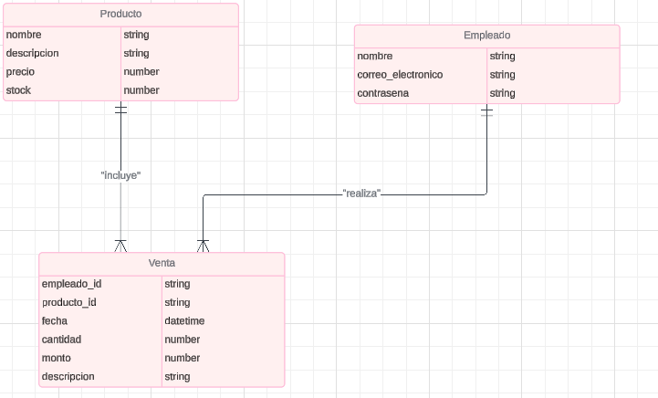

# Gestión de Ventas para Comercio de Suministro de Limpieza

## Modelo de Datos

Para poder instalar la dependencia del proyecto utilizar el siguiente comando

```sh
npm install
```

### Employees

El modelo empleado gestiona la información de los empleados, incluyendo credenciales de acceso. Este modelo permite tener credenciales de acceso, lo cual asegura que cada empleado tenga un identificador único y una contraseña.

```JavaScript
import mongoose from "mongoose";

const productSchema = new mongoose.Schema({
  nombre: {
    type: String,
    required: true,
  },
  descripcion: {
    type: String,
  },
  precio: {
    type: Number,
    required: true,
  },
  stock: {
    type: Number,
    required: true,
  },
});

const Product = mongoose.model("Product", productSchema);

export default Product;

```

### Products

Este modelo gestiona la información de los productos disponibles a la venta. Separo los productos en su propio modelo ya que facilita la gestión del inventario, permite actualizaciones independientes de las ventas.

```JavaScript
import mongoose from "mongoose";

const productsSchema = new mongoose.Schema({
  nombre: {
    type: String,
    require: true,
  },
  descripcion: {
    type: String,
  },
  precio: {
    type: Number,
    require: true,
  },
  stock: {
    type: Number,
    require: true,
  },
});

const Product = new mongoose.model("Product", productsSchema);

export default Product;

```

### Sales

Este modelo registra las ventas realizadas por los empleados. Al referenciar tanto al empleado como al producto, nos permite un seguimiento de las venta.

```JavaScript
import mongoose from "mongoose";

const salesSchema = new mongoose.Schema({
  fecha: { type: Date, default: Date.now },
  cantidad: { type: Number, required: true },
  monto: { type: Number, required: true },
  descripcion: { type: String },
  employees_id: {
    type: mongoose.Schema.Types.ObjectId,
    ref: "Employee",
    required: true,
  },
  products_id: {
    type: mongoose.Schema.Types.ObjectId,
    ref: "Product",
    required: true,
  },
});

const Sale = mongoose.model("Sale", salesSchema);

export default Sale;
```


